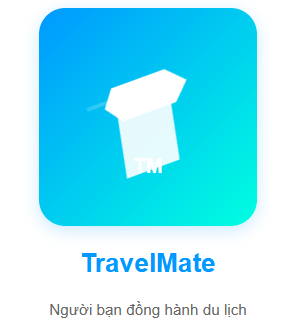

# TravelMate - Người bạn đồng hành du lịch



## Tổng Quan
TravelMate là ứng dụng di động toàn diện được xây dựng bằng React Native và Expo, được thiết kế để trở thành người bạn đồng hành đáng tin cậy trong mọi chuyến du lịch của bạn. Từ đặt phòng khách sạn, khám phá ẩm thực địa phương đến quản lý hành trình, TravelMate cung cấp trải nghiệm du lịch liền mạch và thuận tiện.

## 🌟 Tính Năng Chính

### 🏨 Đặt Phòng & Quản Lý
- Tìm kiếm và đặt phòng khách sạn
- Xem hình ảnh và thông tin chi tiết
- Đánh giá và nhận xét
- Lịch sử đặt phòng
- Quản lý đặt phòng

### 🍴 Dịch Vụ Ẩm Thực
- Đặt món ăn tại khách sạn
- Khám phá ẩm thực địa phương
- Theo dõi đơn hàng thực phẩm
- Đánh giá món ăn

### 🚗 Dịch Vụ Di Chuyển
- Đặt xe
- Theo dõi tài xế
- Lịch sử di chuyển

### 💳 Thanh Toán & Ưu Đãi
- Nhiều phương thức thanh toán
- Tích hợp PayPal
- Quản lý thẻ thanh toán
- Mã giảm giá và voucher

## 📱 Screens & Chức Năng

### Quản Lý Tài Khoản
- **LoginScreen** - Đăng nhập
- **RegisterScreen** - Đăng ký tài khoản
- **MyProfile** - Quản lý thông tin cá nhân
- **EditProfile** - Chỉnh sửa hồ sơ
- **ForgotPassword** - Khôi phục mật khẩu
- **OtpVerification** - Xác thực OTP

### Khám Phá & Đặt Phòng
- **HomeScreen** - Màn hình chính
- **HotelList** - Danh sách khách sạn
- **HotelPhotos** - Thư viện ảnh
- **BookingDetails** - Chi tiết đặt phòng
- **Amenities** - Tiện ích khách sạn
- **Nearby** - Địa điểm lân cận

### Ẩm Thực & Đặt Món
- **Foodcart** - Giỏ hàng thực phẩm
- **Fooddetails** - Chi tiết món ăn
- **Orderfood** - Đặt món
- **OrderConfirm** - Xác nhận đơn hàng

### Đánh Giá & Phản Hồi
- **Review** - Đánh giá
- **RatingScreen** - Xếp hạng
- **Ratingsreviews** - Quản lý đánh giá

### Cài Đặt & Thông Tin
- **SettingsScreen** - Cài đặt ứng dụng
- **PrivacyPolicy** - Chính sách riêng tư
- **FAQScreen** - Câu hỏi thường gặp
- **TermsScreen** - Điều khoản sử dụng

## 🛠 Công Nghệ Sử Dụng

### Frontend
- React Native
- Expo
- React Navigation
- React Native Maps
- Linear Gradient
- Gesture Handler

### Tích Hợp
- PayPal Payment Gateway
- Google Maps API
- Push Notifications
- Real-time Tracking

## 📲 Cài Đặt

1. Clone dự án
```bash
git clone https://github.com/Github-303/uiux_travel_mate.git
cd travelmate
```

2. Cài đặt dependencies
```bash
npm install
```

3. Chạy ứng dụng
```bash
expo start
```

## 🔧 Cấu Trúc Project
```
travelmate/
├── assets/              # Hình ảnh, fonts
├── components/          # Components tái sử dụng
├── screens/            
│   ├── auth/           # Màn hình xác thực
│   ├── booking/        # Đặt phòng
│   ├── food/           # Dịch vụ ẩm thực
│   ├── profile/        # Quản lý tài khoản
│   └── settings/       # Cài đặt
├── navigation/         # Cấu hình điều hướng
├── services/          # API services
├── utils/             # Tiện ích
└── App.js            
```

## 🚀 Hướng Dẫn Build

### Android
```bash
eas build -p android
```

### iOS
```bash
eas build -p ios
```

## 👥 Nhóm Phát Triển
- [**Khánh**] - Team Lead
- [Hảo] - UI/UX Designer
- [An - Tiến] - Frontend Developer
- [**Khánh**] - Backend Developer

## 🤝 Đóng Góp
Chúng tôi luôn chào đón mọi đóng góp từ cộng đồng.

## 📞 Hỗ Trợ
- Email: [bit220084@st.cmcu.edu.vn]
